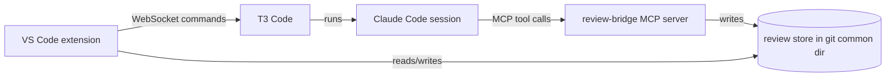

# Branch Review Studio: VS Code extension for reviewing branches with Claude Code agents

Transcript of the planning conversation (T3 Code thread, Claude Opus 5.5 as coordinator; implementation
and second pass were delegated to subagents). User messages are verbatim; assistant messages are
abridged where noted.

## S1. Planning conversation

### User (message 1)

> [screenshot of Visual Studio's sticky scroll: `namespace Barreleye.DbEntities` / `public class
> EntityDBO : PieceOfScenarioWithColor,` / `public void Assign(EntityDBO other)` pinned above
> lines 421–423]
>
> I want an improved workflow for reviewing and editing branches prior to committing to `develop`.
> This could maybe be done as a Visual Studio Code extension or as a purpose-built app. Help me
> figure out what should be built.
>
> I want it to be similar to the user interface on DevOps for reviewing pull requests, except
> instead of leaving comments for humans I will be sending and receiving messages to/from agents.
>
> - I want a special editor interface that will show an interleaved diff, ideally with context
>   lines on top (like in VS, see screenshot) but still permit editing individual lines like in VS
>   Code and ALSO allow sending/receiving comments from agents
> - I will want to be able to connect it directly or indirectly (probably indirectly, given Claude
>   Code's terms of service) to my Claude Code subscription so that apart from sending messages to
>   agents from the editor, I could run a command similar to `/branch-review` which will perform a
>   code review and put comments in relevant places in the app.
> - It would actually be nice if it were connected to T3 Code (which, in turn, is connected to
>   Claude Code) somehow... like, if I have to input a command in T3 Code to kick off the review,
>   that's perfectly fine and probably better because by having the thread in T3 code, I would be
>   able to see that thread from other machines. The tricky part would then be getting the results
>   of the code review into my new code review interface. Likewise if sending a message in the code
>   review tool was actually sending a message to T3 code (but with context) that's fine too.
> - When I send a message to an agent via this new app, but a code review is already in progress,
>   I think the appropriate default behavior is to send a message to a forked version of the thread
>   that produced the code review so that the agent has ample context. But I guess there should be
>   an option for starting a fresh thread as well.
> - I want an easy way to switch to a branch. Usually I would rather pick a branch than a worktree
>   and then if there is already a worktree associated with the branch, the app would go there, but
>   if there is no worktree it will create one. I guess that the tool should have an association
>   between branches and code reviews so that if I switch branches I can switch which code review
>   I'm seeing as well.
> - If it's not a VS Code extension it will need features for navigating around, expecially
>   Ctrl+Shift+F for quick search and Ctrl+P for jumping to files

### Assistant (abridged)

Recommended a VS Code extension rather than a standalone app, because VS Code already provides
the inline diff editor (modified side editable), sticky scroll, the multi-file diff editor
(`vscode.changes`), the Comments API, Ctrl+P and Ctrl+Shift+F. Proposed architecture:



Findings from inspecting the local T3 Code Nightly install: T3 Code has no fork command (only
`thread.create` with `historyImport` + `thread.history.import`, which copies message text only);
the T3 server listens on 0.0.0.0:3773. Proposed a build order (1. read-only UI; 2. MCP bridge and
review skill; 3. T3 adapter; 4. polish) and named risks (inline diff + editing + sticky scroll +
comments together; unstable T3 API; MCP loading in T3-spawned sessions; comment re-anchoring).

### User (message 2)

> [screenshot: T3 Code error "VCS process timed out in GitVcsDriver.isInsideWorkTree: git (D:\)
> after 5000ms"] oh something weird happened in T3 code.
>
> Something I forgot to mention, but which is perhaps obvious, is that I mainly want to compare the
> current local directory with `develop` no matter how many commits it differs by.
>
> I'm not sure what you mean about `git rev-parse --git-common-dir` Because that returns the same
> folder for all worktrees. If you can store JSON files in there that is specific to our tool, and
> do not interfere with `git`, make sure that it has an unambiguous name and comment inside so I
> can tell where it came from when I see it later.
>
> There is already a `/branch-review` tbc, but it sounds like you are proposing a new one.
>
> I wanted proper fork behavior. Anything that trashes the cache and forces new input tokens is not
> helpful. May as well just always start with a clean thread with some basic context if that's not
> possible. Am I to understand that T3 Code can't directly read Claude Code threads? Probably our
> new tool should support both T3 Code and Claude Code if the latter can support forking better...
> Plus if you are going to be building against unstable interfaces in T3 code, we certainly want a
> Claude Code fallback to be available.
>
> I like the idea of a VS Code extension. The extension should be implemented in TypeScript,
> right? It's probably best if you hand off the work to a sub-agent so that your own context stays
> cleaner. Let's see how practical this is: please build it. Follow the Barreleye Programming
> Process (D:\Barreleye\.cursor\skills\barreleye-programming-process\SKILL.md) and Barreleye
> AGENTS.md to the extent they are applicable to this new extension. Make a new repo that includes
> verbatim parts from those files that are relevant to the extension.
>
> One more thing. I want to make sure this is well-encapsulated so that I can easily share it with
> coworkers without requiring that the coworkers use it.
>
> It sounds like you want to just do step one for now? I guess that's okay but why?

### Assistant (abridged)

- The T3 error was a one-off: `git rev-parse` in `D:\` took 0.04 s when re-run.
- Diff base: working files (including uncommitted/untracked) vs `git merge-base origin/develop
  HEAD`, same as DevOps PRs and `/branch-review`.
- The git common dir is shared by all worktrees, which is the point: reviews are per branch. The
  store gets an unambiguous folder name, a `README.txt` and a `"$comment"` field in each JSON file.
- Instead of a new `/branch-review`, add a conditional step to the existing one.
- Each T3 thread is a normal Claude Code session saved under `~/.claude/projects/`; T3 can't adopt
  outside sessions or fork, but `claude --resume <id> --fork-session` is a true fork that keeps the
  prompt-cache prefix. So forks run through the Claude Code CLI (visible in Claude Code, not T3).
- Step 1 alone was suggested to test the riskiest UI assumption first; instead, build in phases
  with a checkpoint after the UI.

## S2. Questions asked and answers

- Q1. Name and location? Options: `agent-review` at `D:\agent-review` (recommended),
  `branch-review-studio` at `D:\branch-review-studio`. **Answer:** "branch-review-studio at
  D:\branch-review-studio".
- Q2. Scope this round? **Answer:** "UI + store + MCP + Claude fork (Recommended)" — phases A, B, C,
  with a checkpoint after A; T3 adapter later.
- Q3. How should forked sessions run? **Answer:** "Both, chosen per message" (default interactive
  terminal, with a background option).
- Q4. May the subagent edit Barreleye's `branch-review.md`? **Answer:** "probably both―We need a way
  for the extension to be conveniently used in different projects, but hooking it into the
  existing branch review makes sense for Barreleye in particular" → generic skill in this repo plus
  an uncommitted conditional hook in Barreleye.
- Q5 (after Phase A checkpoint). Continue with B and C? **Answer:** "yes, continue B and C. I will
  read your message up above in the meantime."
- Q6. Build a generated `.code-workspace` so inline diff applies only to review windows?
  **Unanswered** — not built.
- Q7. Change Barreleye `/branch-review` Step 3 to diff the working tree (`git diff $MERGE_BASE`)
  instead of `$MERGE_BASE..HEAD`? **Unanswered** — not changed.

## S3. Assumptions made without the user's confirmation

- A1. Base branch is configurable (`branchReviewStudio.baseBranch`, default `develop`); an existing
  review's base branch takes precedence over the setting and over the MCP default.
- A2. No per-editor inline diff exists in VS Code 1.140, so the extension does not change
  `diffEditor.renderSideBySide`; the README tells users to pick Inline View themselves.
- A3. Sessions started by Ask Agent pre-approve only this tool's MCP tools
  (`--allowedTools mcp__branch-review-studio`) so replying to a thread doesn't prompt.
- A4. The Barreleye hook posts findings to Branch Review Studio without asking, because posting is
  local.
- A5. Worktrees are created under a sibling folder `<repoName>.worktrees/<branch>` (setting
  `branchReviewStudio.worktreeRoot`).
- A6. The MCP server is registered for the user (`claude mcp add --scope user`) with a stable copy
  at `~/.branch-review-studio/mcp-server.js`; `node` must be on PATH.
- A7. The provenance note names the tool and extension id (`barreleye.branch-review-studio`) rather
  than a local repo path, so it is correct on coworkers' machines.
- A8. Fork options are hidden when the review session's folder no longer exists, because
  `claude --resume` finds sessions by project folder.
- A9. T3 Code sessions load user-scope MCP servers (T3's server bundle passes
  `settingSources: ["user","project","local"]`); not yet observed in a live T3 session.

## S4. End phase

The implementation subagent delivered Phase A (commits `dd8e415`, `4cf4a99`) and Phases B+C
(`50f14fb`). A second-pass subagent then removed duplicated code, added doc comments, and fixed
findings F1–F6:

- F1/F2: `Review.baseBranch` holds a plain branch name; an existing review's base branch takes
  precedence over the setting in both the extension and the MCP server.
- F3: Ask Agent offers only fresh sessions when the review session's folder no longer exists.
- F4: esbuild injects the package version into the MCP server.
- F5: comment threads that can no longer be shown are disposed.
- F6: terminal names and status text use a thread's current line.
- Also: `claude.cmd` shims whose `cli.js` is missing no longer stop the search for `claude.exe`;
  the provenance note names the extension id instead of a local path.

Typecheck passes, 53 vitest tests pass, and the build succeeds. No ticket number (this repo has no
work items). Commit message:

```
Second pass: consistent base branch, safer Ask Agent, less duplication

Agents and the extension could compare a branch against different bases, because the
extension always used the `branchReviewStudio.baseBranch` setting while `review_begin`
defaulted to develop. Now `Review.baseBranch` holds a plain branch name (old
`origin/<branch>` values are normalized by `parseReview`), and an existing review's base
branch takes precedence over both the setting and the MCP default.

### Also

- ask-agent.ts: the QuickPick offers only fresh sessions when the review session's folder
  no longer exists, since `claude --resume` finds sessions by project folder; terminal names
  and status text show a thread's current line instead of the line it was created on
- comments.ts: `hideThread` disposes VS Code comment threads that can no longer be shown,
  e.g. base-side threads when the merge-base is unknown
- claude-cli.ts: Bug fix: a `claude.cmd` shim whose `cli.js` was missing ended the search
  for `claude` before `~/.local/bin` was checked
- store.ts: the provenance note names the extension id instead of the local repo path
- esbuild.mjs injects package.json's version into the MCP server
- files.ts, git.ts: shared `getFullPath`, `getRepoRelativePath`, `getErrorCode`,
  `tryRunGit` and `comparePaths` replace duplicated code; added missing doc comments
- Transcripts/: planning transcript
```

Release notes: Branch Review Studio is a new VS Code extension for reviewing a branch's
uncommitted and committed changes against `develop` with Claude Code. Claude posts review comments
into the diff, and you can reply in a comment thread to send the question to a fork of the session
that wrote the review. Nothing changes for coworkers who don't install it.
