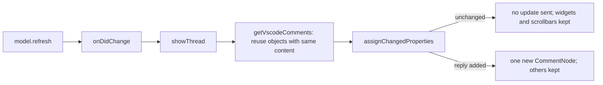

# Comments: long comments keep their scrollbar when the review refreshes

## Planning

This task was delegated by a coordinating agent; the user's messages reached this agent through it.

User's messages (verbatim):

1. "There are two weird things about the scrollbar in the review panel in the text editor. First,
   sometimes it's missing and impossible to scroll (depicted). Second, I can make the scrollbar
   appear by resizing VS Code itself (bigger or smaller) but what scrolls is the individual agent
   message rather than the whole conversation"
2. "the scroll bar disappears very frequently and I wonder if it's because the "X minutes ago"
   marking keeps updating"
3. "ok do P1"

Root cause, from an earlier investigation of VS Code 1.140's source
(src/vs/workbench/contrib/comments/browser/), as relayed by the coordinator: each comment body
has a 20em maximum height with its own scrollbar (`comments.maxHeight`), and the scrollbar's
scroll dimensions are set only in `CommentNode.layout()`, which runs when the widget is shown,
when the editor's width changes, or when `commentThreadBody._refresh` sees the list's size change.
VS Code tells comments apart by object identity, so assigning new comment objects to a thread
disposes and recreates every `CommentNode`; a long comment already capped at 20em comes back at
the same size, `_refresh` skips `layout`, and the new scrollbar never learns the content height,
so there is no scrollbar and the mouse wheel scrolls the editor instead.
`ReviewCommentController.showThread` (src/extension/comments.ts) assigned new comment objects on
every `model.onDidChange`, and `BranchReviewModel.refresh` fires `onDidChange` on every refresh
(window focus, any file save, review-file changes, HEAD changes) even when nothing changed. (So
the user's guess in message 2 was close: the trigger is the refresh, not the timestamp text.)

P1 (the approved fix), summarized from the coordinator: keep each VS Code comment object and
reuse it while its rendered content (body, author label, timestamp, contextValue, mode) is
unchanged; assign `vscodeThread.comments` only when the array differs; avoid re-assigning other
thread properties when unchanged if that sends an update; drop cached comments of deleted
threads and comments; a new reply should append a new object and keep the others. Pure logic may
go in src/core with vitest tests. Add a smoke check named like `Bug_2026_10_CommentScrollbarLost`
if practical. Launch VS Code (the smoke test) at most once at the end, since test windows pop up
over the user's work.

## Findings during research

- F1: In `ExtHostCommentThread` (extHostComments.ts), the setters of `label`, `contextValue`,
  `comments` and `state` always queue an update to the main thread; `range`, `canReply` and
  `collapsibleState` skip equal values.
- F2: `convertToDTOComment` gives each `vscode.Comment` a `uniqueIdInThread` from a map keyed by
  the object, and `commentThreadBody.updateCommentThread` keeps the `CommentNode` of each
  `uniqueIdInThread` that is still present (calling `CommentNode.update`, which re-renders the
  body but keeps the scrollable element) and creates nodes only for new ids. So a reply, which
  appends one new object, keeps the other comments' widgets and scrollbars.
- F3: `setSendTargetFinder` also re-assigned every thread's `contextValue` after each refresh
  (via `trackSendTargets`).

## Questions and assumptions

No questions were asked. Assumptions (unasked):

- D1: A comment whose content changes gets a new object (so its widget is recreated). The
  extension has no comment-editing UI, so this only happens if the review file is edited by
  hand; the other comments keep their widgets.
- D2: The test hook `getThreadContextValue` was generalized to `getVscodeThread` instead of
  adding a second hook for the comments.

## Plan (as implemented)

- src/core/objects.ts: `assignChangedProperties<T, K extends keyof T>(target: T, values: Pick<T, K>)`
  assigns only values that differ (arrays compare item by item with ===); vitest test in
  objects.test.ts.
- src/extension/comments.ts: `showThread` passes label, state, contextValue and comments through
  `assignChangedProperties`; new private `getVscodeComments(thread, shownComments)` reuses the
  thread's current VS Code comments whose content key (JSON of id, body, author label, createdAt,
  author kind, kept in the WeakMap `commentContents`) matches, so comments of deleted threads and
  comments drop out with the objects. `setSendTargetFinder` uses `assignChangedProperties` too.
- extension.ts / scripts/smoke-test.ts: export `getVscodeThread`; smoke check
  `Bug_2026_10_CommentScrollbarLost` asserts that `model.refresh()` leaves a thread's `comments`
  array untouched, and that a reply keeps the existing comment objects.

## End phase

Second pass (subagent): no bugs found; it wrapped one line over 120 columns in objects.ts and
reworded/re-wrapped the doc comments of `commentContents`, `getVscodeComments` and
`getVscodeThread`. It noted that VS Code's `_commentsMap` keeps every comment object assigned to
a thread until the thread is disposed (fewer objects now than before), and that comment editing,
if ever added, would need another look at the reuse logic.

Tests: `npx vitest run` (20 files, 170 tests) and `npx tsc --noEmit -p .` pass. One smoke run
(`npm run smoke-test -- D:\brs-sandbox\Barreleye`, one VS Code launch): all checks pass, including
`Bug_2026_10_CommentScrollbarLost`, except the known focus-dependent "Ctrl+Enter in a new comment
box clicks its primary button" check. The new smoke check was not run against the old code (that
would have needed another launch), but the old `showThread` always assigned a new array, which
its first assertion rejects. The sandbox review file was restored byte for byte afterwards.

Commit message:

    Comments: long comments keep their scrollbar when the review refreshes

    Bug fix: a long comment in a comment thread widget (one taller than VS Code's 20em cap) often
    lost its scrollbar, so it couldn't be scrolled and the mouse wheel scrolled the editor
    instead, until resizing the window brought the scrollbar back. It happened after any review
    refresh (window focus, a file save, a review file or HEAD change), even when nothing had
    changed, because `ReviewCommentController.showThread` assigned new `vscode.Comment` objects
    each time; VS Code recognizes comments by object identity, so it recreated every comment's
    widget, and a recreated widget whose height was already capped never got its scroll size.

    `showThread` now reuses each shown comment object while its content (id, body, author label,
    time, author kind) is unchanged (`getVscodeComments`), and assigns `comments`, `label`,
    `state` and `contextValue` only when they differ, via the new
    `assignChangedProperties` (src/core/objects.ts), since VS Code sends an update for each such
    assignment. `setSendTargetFinder` uses it for `contextValue` too. A new reply adds one object,
    so the other comments keep their widgets.

    Internal:
    - The smoke-test hook `getThreadContextValue` became `getVscodeThread`, used by the new smoke
      check `Bug_2026_10_CommentScrollbarLost`.
